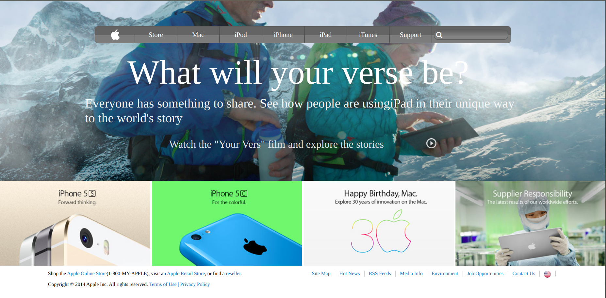

<!-- PROJECT LOGO -->

 

   <h3 align="center">Apple Page</h3>

    A simple clone of the Apple Page.

<!-- TABLE OF CONTENTS -->
## Table of Contents

* [About the Project](#about-the-project)
  * [Built With](#built-with)
* [Contact](#contact)
* [Acknowledgements](#acknowledgements)

<!-- ABOUT THE PROJECT -->
## About The Project

  I am dflexcee. I am part of the Microverse Project and I did this page according to the required specifications.  

### Build With

* [Html]()
* [CSS]()
* [VSCODE]()

### Contact
* amflexcee - [@amflexcee](https://twitter.com/amflexcee)
* Project Link (https://rawcdn.githack.com/Dflexcee/APPLE-WEB-CLONE/b2ff369a127347be52fcc4a0563dc955a1cad317/index.html)

### Acknowledgements

* [GitHub](https://github.com)
* [VSCODE]()
* [StyleLint]()
* [Stickler]()
